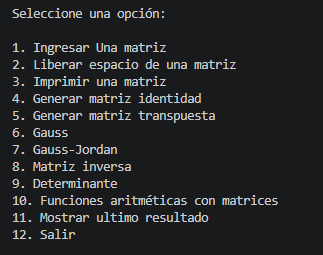
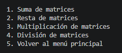
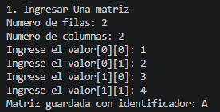
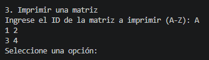
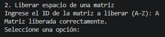
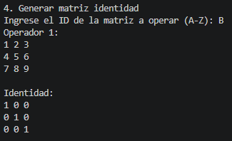
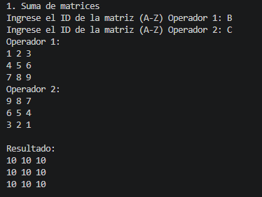

# Setup ARM64 Proyecto 2 ARQUI1B

Guia unica para preparar el entorno de trabajo en Raspberry Pi (ARM64)

## 1) Requisitos

- Linux.
- `make`.
- VS Code + extension C/C++ (opcional para depuracion grafica).
- Extension `StackScope` (opcional para inspeccion visual de stack y memoria).

## 2) Instalacion

```bash
sudo apt update
sudo apt install -y binutils gdb build-essential
```


## 3) Ejecución

- Dirigirse a la carpeta src
- Limpieza previa

```bash
make clean
```
- Armado del ejecutable

```bash
make
```

- Ejecución del código máquina

```bash
./build/main
```

## 4) Funcionamiento

Pantalla de inicio donde se muestran todas las opciones disponibles en el menú principal y el estado del programa



Submenú de operaciones aritméticas con validación automática de compatibilidad entre matrices



Proceso de ingreso de matriz: introduce filas, columnas y luego cada valor ordenado por fila



Visualización de matriz: cada fila impresa en línea separada con espacios entre elementos



Liberación de memoria: valida ID y confirma la desasignación segura de la matriz



Operación sobre una matriz: solicita ID, valida dimensiones y muestra resultado o mensaje de error



Operación entre dos matrices: solicita ambos IDs, verifica compatibilidad y ejecuta la operación


