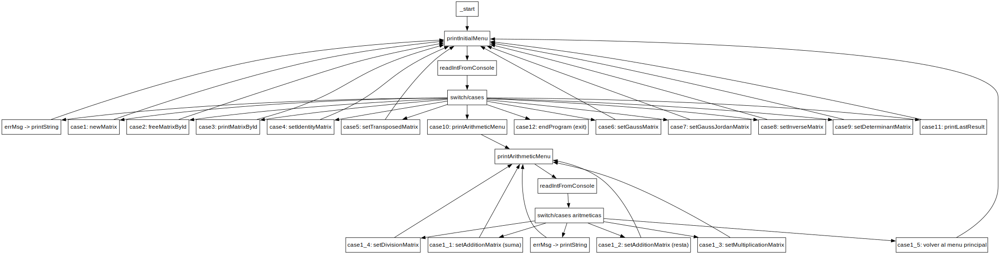
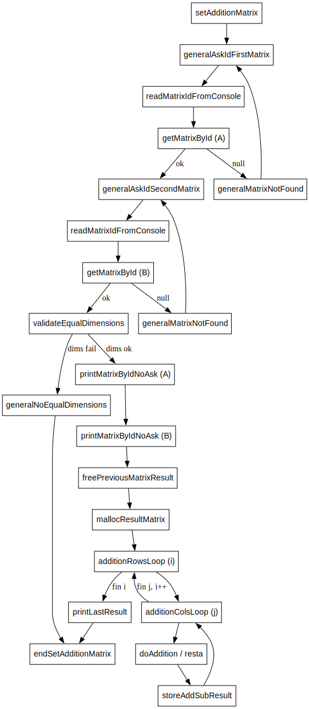
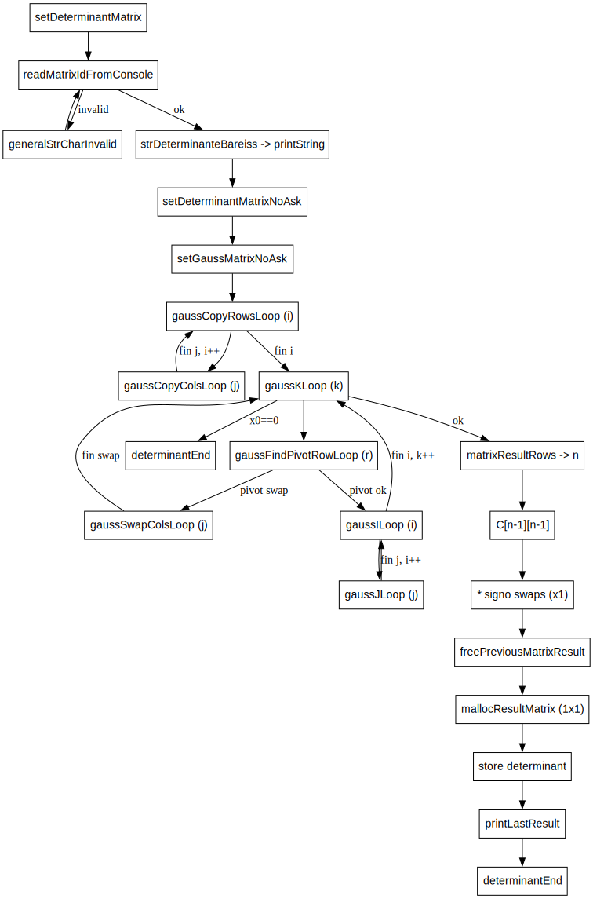
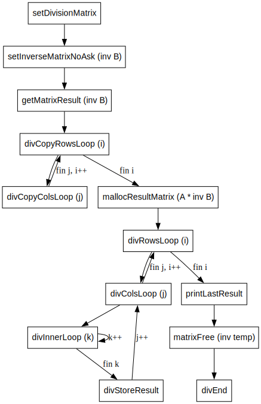
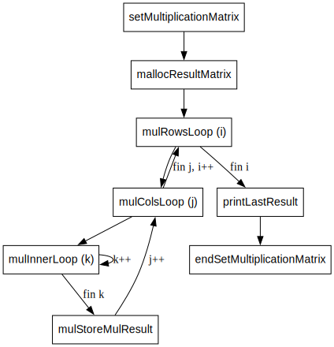
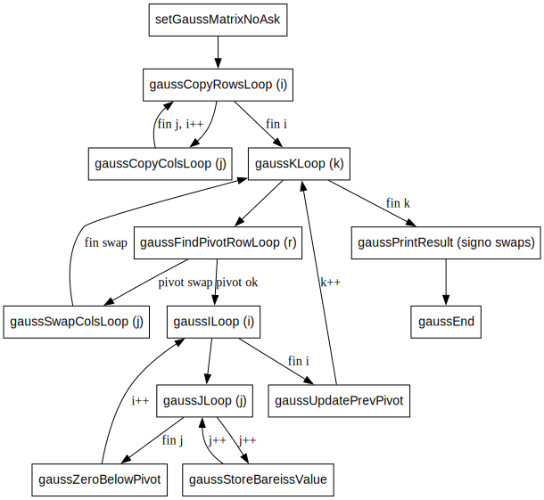
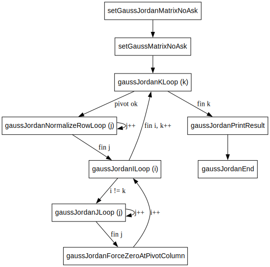
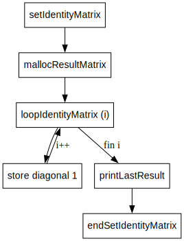
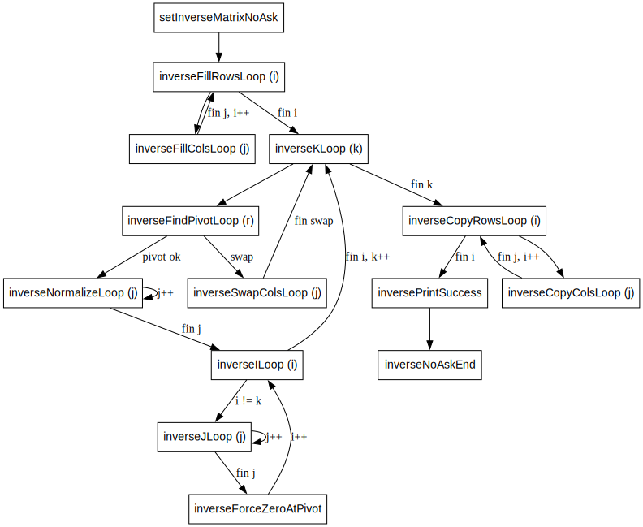

# Documentacion Tecnica - Proyecto 2 ARQUI1B (ARM64)

Este documento describe la estructura tecnica del proyecto, los modulos en ensamblador AArch64 y los fragmentos clave de codigo. Todos los fragmentos reproducen exactamente el codigo fuente y se acompanian de una explicacion tecnica.

## 1) Arquitectura general y punto de entrada (main.s)

**Responsabilidad:** define el punto de entrada `_start`, imprime menus, lee opciones y despacha a las funciones de matrices y aritmetica.

**Funciones clave llamadas:** `printString`, `printEnter`, `readIntFromConsole`, `newMatrix`, `freeMatrixById`, `printMatrixById`, `setIdentityMatrix`, `setTransposedMatrix`, `setGaussMatrix`, `setGaussJordanMatrix`, `setInverseMatrix`, `setDeterminantMatrix`, `printLastResult`, `setAdditionMatrix`, `setMultiplicationMatrix`, `setDivisionMatrix`.

**Fragmento de despacho de menu principal y submenu aritmetico:**

```asm
.section .text
.global _start               // Punto de entrada

_start:
    ldr x0, =strBienvenida
    bl printString
    bl printEnter

// Imprimimos el menú inicial
printInitialMenu:
    ldr x0, =strInstruction
    bl printString
    bl printEnter
    ldr x0, =str1
    bl printString
    ldr x0, =str2
    bl printString
    ldr x0, =str3
    bl printString
    ldr x0, =str4
    bl printString
    ldr x0, =str5
    bl printString
    ldr x0, =str6
    bl printString
    ldr x0, =str7
    bl printString
    ldr x0, =str8
    bl printString
    ldr x0, =str9
    bl printString
    ldr x0, =str10
    bl printString
    ldr x0, =str11
    bl printString
    ldr x0, =str12
    bl printString
    bl printEnter

    // Leemos la opción ingresada en la consola
    bl readIntFromConsole

    str x0, [sp, #-16]!// Guardamos la opción ingresada en la pila
    bl printEnter
    ldr x0, [sp], #16 // Recuperamos la opción ingresada de la pila

//SWITCH CASE PARA LAS OPCIONES DEL MENU
    cmp x0, #1
    beq case1
    cmp x0, #2
    beq case2
    cmp x0, #3
    beq case3
    cmp x0, #4
    beq case4
    cmp x0, #5
    beq case5
    cmp x0, #6
    beq case6
    cmp x0, #7
    beq case7
    cmp x0, #8
    beq case8
    cmp x0, #9
    beq case9
    cmp x0, #10
    beq case10
    cmp x0, #11
    beq case11
    cmp x0, #12
    beq case12

    // Si la opción no es válida, imprimimos un mensaje de error
    ldr x0, =errMsg
    bl printString
    // Volvemos a imprimir el menú inicial
    b printInitialMenu

case1: // Ingresar una matriz
    ldr x0, =str1
    bl printString
    bl newMatrix
    b printInitialMenu

case2: // Liberar espacio de una matriz
    ldr x0, =str2
    bl printString
    bl freeMatrixById
    b printInitialMenu
  
case3: // Imprimir una matriz
    ldr x0, =str3
    bl printString
    bl printMatrixById
    b printInitialMenu

case4: // Generar matriz identidad
    ldr x0, =str4
    bl printString
    bl setIdentityMatrix
    b printInitialMenu

case5: // Generar matriz transpuesta
    ldr x0, =str5
    bl printString
    bl setTransposedMatrix
    b printInitialMenu

case6:
    ldr x0, =str6
    bl printString
    bl setGaussMatrix
    b printInitialMenu

case7:
    ldr x0, =str7
    bl printString
    bl setGaussJordanMatrix
    b printInitialMenu

case8:
    ldr x0, =str8
    bl printString
    bl setInverseMatrix
    b printInitialMenu

case9:
    ldr x0, =str9
    bl printString
    bl setDeterminantMatrix
    b printInitialMenu

case10: // Funciones aritméticas con matrices
    b printArithmeticMenu

case11: // Mostrar ultimo resultado
    ldr x0, =str11
    bl printString
    bl printLastResult
    b printInitialMenu

case12: //Salir
    ldr x0, =strExit
    bl printString
    b endProgram

// imprimir el menú de operaciones aritméticas con matrices
printArithmeticMenu:
    bl printEnter
    ldr x0, =str1_1
    bl printString
    ldr x0, =str1_2
    bl printString
    ldr x0, =str1_3
    bl printString
    ldr x0, =str1_4
    bl printString
    ldr x0, =str1_5
    bl printString
    bl printEnter

//SWITCH CASE PARA LAS OPCIONES SEGUNDO MENU
    bl readIntFromConsole

    str x0, [sp, #-16]!// Guardamos la opción ingresada en la pila
    bl printEnter
    ldr x0, [sp], #16 // Recuperamos la opción ingresada de la pila

    cmp x0, #1
    beq case1_1
    cmp x0, #2
    beq case1_2
    cmp x0, #3
    beq case1_3
    cmp x0, #4
    beq case1_4
    cmp x0, #5
    beq case1_5
    // Si la opción no es válida, imprimimos un mensaje de error
    ldr x0, =errMsg
    bl printString
    // Volvemos a imprimir el menú de operaciones aritméticas
    b printArithmeticMenu

case1_1:
    ldr x0, =str1_1
    bl printString
    mov x0, #0 // modo suma
    bl setAdditionMatrix
    b printArithmeticMenu

case1_2:
    ldr x0, =str1_2
    bl printString
    mov x0, #1 // modo resta
    bl setAdditionMatrix
    b printArithmeticMenu

case1_3:
    ldr x0, =str1_3
    bl printString
    bl setMultiplicationMatrix
    b printArithmeticMenu

case1_4:
    ldr x0, =str1_4
    bl printString
    bl setDivisionMatrix
    b printArithmeticMenu

case1_5:
    b printInitialMenu
```

## 2) Estado global y almacenamiento de matrices (matrix.s)

**Responsabilidad:** administra el almacenamiento de hasta 26 matrices (A-Z), su metadata (filas/columnas), el resultado global y las utilidades de impresion/validacion.

### 2.1 Estructuras globales

```asm
.section .bss
    .align 3
    // Aceptaremos 26 matrices (A..Z)
    matrixPointers: .skip 208      // Apuntadores de cada matriz 26 * 8 bytes
    matrixRows: .skip 104          // Cantidad de filas para cada matriz 26 * 4 bytes
    matrixCols: .skip 104          // Cantidad de columnas para cada matriz 26 * 4 bytes
    matrixIds: .skip 26            // ids ASCII: A..Z
    matrixCount: .skip 4           // Contador de matrices creadas (0..26)
    matrixResultPointer: .skip 8 // Puntero para almacenar resultados de operaciones entre matrices
    matrixResultRows: .skip 4 // Filas de la matriz resultado
    matrixResultCols: .skip 4 // Columnas de la matriz resultado
```

### 2.2 Creacion de matriz y asignacion de ID

```asm
// 1) Calcula bytes a reservar: filas * columnas * 4 (int32)
    ldr w11, [fp, #-4] // carga filas del stack
    ldr w12, [fp, #-8] // carga columnas del stack
    mul w13, w11, w12 // calcula filas * columnas
    lsl w13, w13, #2 // multiplicamos por 4 para obtener bytes a reservar
    uxtw x0, w13 // Convierte a 64 bits para enviar a matrixMalloc en x0

// 2) Reserva memoria con matrixMalloc (syscall mmap) y calcula el indice para la nueva matriz
    bl matrixMalloc // reservamos memoria y obtenemos puntero base en x0
    str x0, [fp, #-16] // Guardamos el puntero resultante en el stack

    ldr x14, =matrixCount // Carga la direccion de matrixCount
    ldr w15, [x14] // Carga el valor actual de matrixCount (indice para la nueva matriz)
    str w15, [fp, #-20] // Guardamos el indice en el stack

// 3) Guarda puntero y dimensiones en arrays globales por indice

    // Proceso para guardar puntero en matrixPointers[indice]
    ldr x16, =matrixPointers // Carga la direccion de matrixPointers
    uxtw x17, w15 // Convierte a 64 bits
    lsl x17, x17, #3 // Multiplica por 8 para obtener el offset correcto (punteros de 64 bits)
    add x16, x16, x17 // Calcula la direccion de matrixPointers[indice]
    ldr x0, [fp, #-16] // Carga el puntero de la matriz desde el stack
    str x0, [x16] // Guarda el puntero en matrixPointers[indice]

    // Proceso para guardar cantidad de filas en matrixRows[indice]
    ldr x16, =matrixRows // Carga la direccion de matrixRows
    uxtw x17, w15 // Convierte a 64 bits
    lsl x17, x17, #2 // Multiplica por 4 para obtener el offset correcto (enteros de 32 bits)
    add x16, x16, x17 // Calcula la direccion de matrixRows[indice]
    ldr w0, [fp, #-4] // Carga filas del stack
    str w0, [x16] // Guarda filas en matrixRows[indice]

    // Proceso para guardar cantidad de columnas en matrixCols[indice]
    ldr x16, =matrixCols // Carga la direccion de matrixCols
    uxtw x17, w15 // Convierte a 64 bits
    lsl x17, x17, #2 // Multiplica por 4 para obtener el offset correcto (enteros de 32 bits)
    add x16, x16, x17 // Calcula la direccion de matrixCols[indice]
    ldr w0, [fp, #-8] // Carga columnas del stack
    str w0, [x16]  // Guarda columnas en matrixCols[indice]

// 4) Asigna ID secuencial (A + indice)
    ldr x16, =matrixIds // Carga la direccion de matrixIds
    uxtw x17, w15 // Convierte a 64
    add x16, x16, x17 // Calcula la direccion de matrixIds[indice]
    mov w0, #'A' // Valor ASCII de 'A'
    add w0, w0, w15 // Suma el indice para obtener el ID correcto (A + indice)
    strb w0, [x16] // Guarda el ID en matrixIds[indice]
```

### 2.3 Resolucion por ID (A-Z)

```asm
getMatrixById:
    stp fp, lr, [sp, #-0x10]!
    mov fp, sp

    mov w9, w0 // Guardamos el ID ingresado en w9 para usarlo en la búsqueda de la matriz
    cmp w9, #'A' 
    blt notFoundMatrix // Si es menor que 'A', no es un ID válido, vamos a la etiqueta de matriz no encontrada
    cmp w9, #'Z' //
    bgt notFoundMatrix // Si es mayor que 'Z', no es un ID válido, vamos a la etiqueta de matriz no encontrada

    // Convierte ID a indice: A->0, B->1, ...
    sub w10, w9, #'A' // Calculamos el indice interno restando el valor ASCII de 'A' al ID ingresado
    ldr x11, =matrixCount // Carga la direccion de matrixCount
    ldr w12, [x11] // Carga la cantidad de matrices creadas (matrixCount)
    cmp w10, w12 
    bhs notFoundMatrix // Si el indice calculado es mayor o igual a matrixCount, significa que el ID no corresponde a una matriz creada, vamos a la etiqueta de matriz no encontrada

    // Carga puntero y dimensiones del indice encontrado
    ldr x13, =matrixPointers // Carga la direccion de matrixPointers
    uxtw x14, w10 // Convierte a 64 bits 
    lsl x14, x14, #3 // Multiplica por 8 para obtener el offset correcto (punteros de 64 bits)
    ldr x0, [x13, x14] // Carga el puntero de la matriz encontrada en x0 para el retorno

    ldr x13, =matrixRows // Carga la direccion de matrixRows
    uxtw x14, w10 // Convierte a 64
    lsl x14, x14, #2 // Multiplica por 4 para obtener el offset correcto (enteros de 32 bits)
    ldr w1, [x13, x14] // Carga la cantidad de filas de la matriz encontrada en w1 para el retorno

    ldr x13, =matrixCols // Carga la direccion de matrixCols
    uxtw x14, w10 // Convierte a 64 bits
    lsl x14, x14, #2 // Multiplica por 4 para obtener el offset correcto (enteros de 32 bits)
    ldr w2, [x13, x14] // Carga la cantidad de columnas de la matriz encontrada en w2 para el retorno

    ldp fp, lr, [sp], #0x10
    ret
```

### 2.4 Matriz resultado y memoria dinamica

```asm
mallocResultMatrix:
    stp fp, lr, [sp, #-0x10]!
    mov fp, sp
    sub sp, sp, #16 // espacio para guardar filas y columnas de la matriz resultado

    str w0, [fp, #-4] // Guardamos filas resultado en el stack
    str w1, [fp, #-8] // Guardamos columnas resultado en el stack

    // Reservamos memoria para la nueva matriz resultado usando matrixMalloc
    ldr w11, [fp, #-4] // Carga filas del stack
    ldr w12, [fp, #-8] // Carga columnas del stack
    mul w13, w11, w12 // Calcula cantidad de elementos: filas * columnas
    lsl w13, w13, #2 // Multiplica por 4 para obtener bytes a reservar
    uxtw x0, w13 // Convierte a 64 bits para enviar a matrixMalloc en x0
    bl matrixMalloc // reservamos memoria y obtenemos puntero base en x0

    // Guardamos el puntero de la nueva matriz transpuesta en matrixResultPointer para su uso posterior
    ldr x14, =matrixResultPointer // Carga la direccion de matrixResultPointer
    str x0, [x14] // Guarda el puntero de la nueva matriz transpuesta en matrixResultPointer
    // Guardamos las dimensiones de la matriz transpuesta en matrixResultRows y matrixResultCols para su uso posterior
    ldr x14, =matrixResultRows // Carga la direccion de matrixResultRows
    ldr w11, [fp, #-4] // Carga filas del stack
    str w11, [x14] // Guarda filas de la matriz resultado
    ldr x14, =matrixResultCols // Carga la direccion de matrixResultCols
    ldr w12, [fp, #-8] // Carga columnas del stack
    str w12, [x14] // Guarda columnas de la matriz resultado

    add sp, sp, #16
    ldp fp, lr, [sp], #0x10
    ret

matrixMalloc:
    stp fp, lr, [sp, #-0x10]!
    mov fp, sp

    mov x1, x0
    mov x0, #0
    mov x2, #0x3
    mov x3, #0x22
    mov x4, #-1
    mov x5, #0
    mov x8, #222
    svc #0

    ldp fp, lr, [sp], #0x10
    ret

matrixFree:
    stp fp, lr, [sp, #-0x10]!
    mov fp, sp

    mov x8, #215
    svc #0

    ldp fp, lr, [sp], #0x10
    ret
```

## 3) Utilidades de entrada/salida (utils.s)

**Responsabilidad:** imprimir cadenas y enteros, leer enteros y IDs de matrices, y convertir texto a entero.

### 3.1 Impresion de cadenas (syscall write)

```asm
printString: //x0 string address to print
    stp fp, lr, [sp, #-0x10]!
    mov fp, sp
    mov x7, x0
    bl countBytes
    mov x2, x0
    mov x0, 1
    mov x1, x7
    mov x8, 64
    svc 0
    ldp fp, lr, [sp], #0x10
    ret
```

### 3.2 Lectura de enteros y validacion

```asm
readIntFromConsole:
  stp fp, lr, [sp, #-0x10]!
  mov fp, sp

  bl cleanUpInput
  mov x0, 0 // preparar para leer de stdin
  ldr x1, =input
  mov x2, 32 
  mov x8, 63 // syscall read
  svc 0 // ejecuta lectura
  cmp x0, #1 // EOF o error de lectura
  blt errorInputAskInteger
  ldr x0, =input // cargar dirección del buffer en x0 para validación

loopValidationInput:
  ldrb w1, [x0], #1 // leemos byte a byte
  cmp w1, 0x0 // null
  beq endLoopValidationInput // si es null, terminamos validación
  cmp w1, #10 // nueva línea
  beq loopValidationInput // si es nueva línea, la ignoramos y seguimos validando
  cmp w1, #48 // '0'
  blt errorInputAskInteger // si es menor que '0', es inválido
  cmp w1, #57 // '9'
  bgt errorInputAskInteger // si es mayor que '9', es inválido
  b loopValidationInput

endLoopValidationInput:
  ldr x0, =input // cargar dirección del buffer en x0
  mov x1, #10 // caracter de nueva línea para indicar el final de la cadena
  bl funcAtoiWithCounter

  ldp fp, lr, [sp], #0x10
  ret
```

### 3.3 Lectura de ID de matriz (A-Z)

```asm
readMatrixIdFromConsole:
    stp fp, lr, [sp, #-0x10]!
    mov fp, sp

    bl cleanUpInput // Limpiamos el buffer de entrada antes de leer el ID
    mov x0, #0 // preparar para leer de stdin
    ldr x1, =input // direccion del buffer de entrada
    mov x2, #32 // tamaño del buffer de entrada
    mov x8, #63 // syscall read
    svc #0 // ejecuta lectura
    cmp x0, #1
    blt invalidMatrixId // Si no se leyó nada o hubo un error, retornamos ID inválido

    ldr x1, =input // Carga la direccion del buffer de entrada para procesar el ID ingresado
    ldrb w0, [x1] // Lee el primer byte del buffer, que debería ser el ID ingresado

    cmp w0, #'a'
    blt checkUpperId // Si es menor que 'a', no es una letra minúscula, vamos a verificar si es mayúscula
    cmp w0, #'z' 
    bgt checkUpperId // Si es mayor que 'z', no es una letra minúscula, vamos a verificar si es mayúscula
    sub w0, w0, #32 // Convertimos a mayúscula restando 32 al valor ASCII (a->A, b->B, etc.)

checkUpperId:
    cmp w0, #'A' 
    blt invalidMatrixId // Si es menor que 'A', no es una letra mayúscula, ID inválido
    cmp w0, #'Z'
    bgt invalidMatrixId // Si es mayor que 'Z', no es una letra mayúscula, ID inválido

    ldp fp, lr, [sp], #0x10 
    ret
```

### 3.4 Impresion de enteros (itoa + write)

```asm
printInteger:
  stp fp, lr, [sp, #-0x10]!
  mov fp, sp

  mov x7, x0
  bl cleanUpOutput
  adrp x1, output
  add x1, x1, :lo12:output
  mov x3, #0

  cmp x7, #0
  bge printIntegerPositive

  mov w4, #'-'
  strb w4, [x1]
  neg x0, x7
  add x1, x1, #1
  bl itoa
  b printIntegerWrite

printIntegerPositive:
  mov x0, x7
  bl itoa

printIntegerWrite:
  adrp x0, output
  add x0, x0, :lo12:output
  bl printString

  ldp fp, lr, [sp], #0x10
  ret
```

## 4) Funciones de matrices (matrixFunctions)

### 4.1 Matriz identidad (identity.s)

**Funcion:** `setIdentityMatrix`

**Dependencias:** `getMatrixById`, `generalMatrixNotFound`, `generalNotSquareMatrix`, `freePreviousMatrixResult`, `mallocResultMatrix`, `printMatrixByIdNoAsk`, `printLastResult`.

**Fragmento clave (llenado de diagonal):**

```asm
loopIdentityMatrix:
    ldr w9, [fp, #-36] // Cargamos i de la matriz resultado
    ldr w10, [fp, #-28] // Cargamos filas de la matriz resultado
    cmp w9, w10
    bge printIdentityResult // Si i >= filas, terminamos de llenar la matriz

    // Calculamos el offset para la posición (i, i) en la matriz resultado y almacenamos un 1 allí
    ldr w11, [fp, #-32] // Cargamos columnas de la matriz resultado
    mul w13, w9, w11 // Calculamos la posición base de la fila: i * columnas de la matriz resultado
    add w13, w13, w9 // Sumamos i para obtener el offset total en elementos: i * columnas + i
    lsl w14, w13, #2 // Multiplicamos por 4 para obtener el offset en bytes
    ldr x15, [fp, #-24] // Cargamos el puntero de la matriz resultado

    mov w0, #1 // valor a almacenar en la diagonal
    str w0, [x15, x14] // Almacenamos 1 en [i][i]

    add w9, w9, #1 // i++
    str w9, [fp, #-36] // Guardamos i actualizado
    b loopIdentityMatrix
```

### 4.2 Matriz transpuesta (transposed.s)

**Funcion:** `setTransposedMatrix`

**Dependencias:** `getMatrixById`, `freePreviousMatrixResult`, `mallocResultMatrix`, `printMatrixByIdNoAsk`, `printLastResult`.

**Fragmento clave (indices transpuestos):**

```asm
transposedColsLoop:
    ldr w9, [fp, #-36] // Carga i
    ldr w10, [fp, #-40] // Carga j
    ldr w11, [fp, #-16] // Carga total de columnas de la matriz original
    cmp w10, w11
    bge nextTransposedRow // si terminamos de iterar todas las columnas, vamos a la siguiente fila, si no, seguimos iterando para la fila actual

    // Offset origen: (i * columnas + j) * 4
    mul w13, w9, w11 // Calculamos la posición base de la fila: i * columnas de la matriz original
    add w13, w13, w10 // Sumamos la columna para obtener el offset total en elementos: i * columnas + j
    lsl w14, w13, #2 // Multiplicamos por 4 para obtener el offset en bytes
    ldr x15, [fp, #-8] // Carga el puntero base de la matriz original
    ldr w0, [x15, x14] // Carga el valor del elemento actual de la matriz original en w0

    // Offset destino: (j * columnas + i) * 4 (para la matriz transpuesta, las filas y columnas se invierten)
    ldr w12, [fp, #-32] // Cargamos columnas de la matriz resultado
    mul w13, w10, w12 // Calculamos la posición base de la fila en la matriz resultado: j * columnas de la matriz resultado
    add w13, w13, w9 // Sumamos i para obtener el offset total en elementos: j * columnas + i
    lsl w14, w13, #2 // Multiplicamos por 4 para obtener el offset en bytes
    ldr x15, [fp, #-24] // Carga el puntero base de la matriz resultado

    str w0, [x15, x14] // Almacena el valor transpuesto en la posición correcta de la matriz resultado
```

### 4.3 Gauss (Bareiss) (gauss.s)

**Funcion:** `setGaussMatrixNoAsk`

**Dependencias:** `getMatrixById`, `freePreviousMatrixResult`, `mallocResultMatrix`, `printMatrixByIdNoAsk`, `printLastResult`.

**Fragmento clave (Bareiss y pivote):**

```asm
    // Bareiss evita decimales:
    // nuevo = (pivot * aij - aik * akj) / prevPivot
    mul x10, x1, x7 // pivot * aij
    mul x11, x4, x9 // aik * akj
    sub x10, x10, x11 // pivot * aij - aik * akj

    // Si prevPivot == 1, la división no cambia el valor.
    ldr x28, [fp, #-56] // pivote anterior
    cmp x28, #1
    beq gaussStoreBareissValue // Si prevPivot es 1, no necesitamos dividir, vamos directo a almacenar el nuevo valor calculado.
    sdiv x10, x10, x28 // división entera truncada hacia cero
```

### 4.4 Gauss-Jordan (gausJordan.s)

**Funcion:** `setGaussJordanMatrixNoAsk`

**Dependencias:** `setGaussMatrixNoAsk`, `printLastResult`.

**Fragmento clave (normalizacion + eliminacion):**

```asm
gaussJordanNormalizeRowLoop:
    ldr w12, [fp, #-64] // Cargamos j
    ldr w11, [fp, #-52] // Cargamos columnas
    cmp w12, w11
    bge gaussJordanEliminateRows // Si terminamos columnas, pasamos a eliminar filas

    ldr w9, [fp, #-56] // Cargamos k para calcular offset
    mul w13, w9, w11 // Calculamos offset base de la fila pivote multiplicando por cantidad de columnas
    add w13, w13, w12  // Sumamos j para obtener offset total del elemento actual en la fila pivote
    lsl w14, w13, #2 // Multiplicamos por 4 para obtener offset en bytes
    ldr x15, [fp, #-8] // Cargamos puntero base de la matriz resultado
    ldrsw x10, [x15, x14] // C[k][j] para normalizarlo dividiendo por el pivote

    ldr x11, [fp, #-16] // Cargamos pivot para dividir
    sdiv x10, x10, x11 // Normalizamos: C[k][j] = C[k][j] / pivot
    str w10, [x15, x14] // Guardamos el valor normalizado en el stack temporalmente

    add w12, w12, #1 // j++
    str w12, [fp, #-64] // Guardamos j actualizado
    b gaussJordanNormalizeRowLoop // Repetimos para la siguiente columna de la fila pivote
```

### 4.5 Matriz inversa por Aumentada (inverse.s)

**Funcion:** `setInverseMatrixNoAsk`

**Dependencias:** `getMatrixById`, `matrixMalloc`, `matrixFree`, `mallocResultMatrix`, `printLastResult`.

**Fragmento clave (construccion de Aumentada [A|I]):**

```asm
    // Calculamos columnas de Aumentada = 2n y bytes = n * (2n) * 4.
    ldr w9, [fp, #-12] // Cargamos n (filas = columnas de A)
    lsl w10, w9, #1 // columnas de Aumentada = 2n
    str w10, [fp, #-36] // Guardamos columnas de Aumentada
    mul w11, w9, w10 // n * (2n)
    lsl w11, w11, #2 // bytes de Aumentada = n * (2n) * 4
    str w11, [fp, #-32] // Guardamos bytes de Aumentada
    uxtw x0, w11 // Convertimos a 64 bits para malloc
    bl matrixMalloc // Reservamos memoria para matriz aumentada, puntero en x0
    str x0, [fp, #-24]

    // Inicializamos Aumentada con [A | I].
    mov w9, #0
    str w9, [fp, #-44] // Guardamos i = 0 en el stack

inverseFillRowsLoop:
    ldr w9, [fp, #-44] // Cargamos i
    ldr w10, [fp, #-12] // Cargamos n
    cmp w9, w10
    bge inverseStartJordan // Si i >= n, terminamos de llenar Aumentada y comenzamos Gauss-Jordan
```

**Fragmento clave (normalizacion y eliminacion en Aumentada):**

```asm
inverseNormalizeLoop:
    ldr w12, [fp, #-48] // Cargamos j
    ldr w13, [fp, #-36] // Cargamos columnas de Aumentada (2n)
    cmp w12, w13
    bge inverseEliminateOtherRows // Si j >= 2n, terminamos de normalizar la fila pivote y pasamos a eliminar los valores en la columna pivote para las otras filas

    mul w14, w9, w13 // Calculamos la posición base de la fila k: k * columnas de Aumentada
    add w14, w14, w12 // Sumamos j para obtener el offset total en elementos: k * columnas de Aumentada + j
    lsl w14, w14, #2 // Multiplicamos por 4 para obtener el offset en bytes
    ldr x15, [fp, #-24] // Cargamos el puntero de Aumentada
    ldrsw x16, [x15, x14] // Cargamos Aumentada[k][j] como valor de 32 bits con signo para la división

    ldrsw x17, [fp, #-56] // Cargamos el pivote como valor de 32 bits con signo para la división
    sdiv x16, x16, x17 // Dividimos Aumentada[k][j] por el pivote para normalizar la fila pivote
    str w16, [x15, x14] // Almacenamos el valor normalizado de vuelta en Aumentada[k][j]
```

## 5) Operaciones aritmeticas (matrixArithmetic)

### 5.1 Suma/Resta (addition.s)

**Funcion:** `setAdditionMatrix` (modo 0 = suma, 1 = resta)

**Dependencias:** `getMatrixById`, `generalNoEqualDimensions`, `freePreviousMatrixResult`, `mallocResultMatrix`.

**Fragmento clave (bucle de suma/resta):**

```asm
    // Aplicamos operación seleccionada y guardamos en resultado[i][j]
    ldr w11, [fp, #-60] // Cargamos modo: 0 suma, 1 resta
    cmp w11, #0
    beq doAddition
    sub w12, w12, w13 // resta: operador1 - operador2
    b storeAddSubResult

doAddition:
    add w12, w12, w13 // suma: operador1 + operador2
```

### 5.2 Multiplicacion (multiplication.s)

**Funcion:** `setMultiplicationMatrix`

**Dependencias:** `getMatrixById`, `generalColsNotEqualRows`, `freePreviousMatrixResult`, `mallocResultMatrix`.

**Fragmento clave (triple loop):**

```asm
// acumulador += A[i][k] * B[k][j]
    mul w14, w12, w13 // w14 = A[i][k] * B[k][j]
    ldr w15, [fp, #-64] // Cargamos acumulador actual
    add w15, w15, w14 // Sumamos al acumulador el nuevo producto
    str w15, [fp, #-64] // Guardamos el acumulador actualizado en el stack
```

### 5.3 Division A * inv(B) (division.s)

**Funcion:** `setDivisionMatrix`

**Dependencias:** `setInverseMatrixNoAsk`, `getMatrixResult`, `matrixMalloc`, `matrixFree`, `freePreviousMatrixResult`.

**Fragmento clave (calculo de inversa y multiplicacion):**

```asm
    ldr x0, =strDivisionCalcInverse
    bl printString // Imprime "Calculando inversa del Operador 2..."
    ldr w0, [fp, #-88]
    bl setInverseMatrixNoAsk // Calcula inv(B), resultado en matrixResultPointer, retorno en w0: 1 si se calculó, 0 si no se pudo calcular
    cmp x0, #1 // Verificamos si se calculó la inversa correctamente
    beq divLoadInverseResult // Si se calculó, continuamos con la multiplicación A * inv(B)
    b divEnd // setInverseMatrixNoAsk mostró mensaje de error específico para el caso, así que solo terminamos sin modificar matrixResultPointer
```

### 5.4 Determinante (determinant.s)

**Funcion:** `setDeterminantMatrixNoAsk`

**Dependencias:** `setGaussMatrixNoAsk`, `mallocResultMatrix`, `printLastResult`.

**Fragmento clave (usar ultimo pivote con signo):**

```asm
    // offset ultimo elemento diagonal: ((n * n) - 1) * 4
    mul w11, w10, w10 // Calculamos n*n
    sub w11, w11, #1 // Restamos 1 para obtener el índice del último elemento en términos de cantidad de elementos
    lsl w12, w11, #2 // Multiplicamos por 4 para obtener el offset en bytes del último elemento diagonal C[n-1][n-1]

    ldr x13, [fp, #-8] // Cargamos el puntero de la matriz triangular C
    ldrsw x14, [x13, x12] // Cargamos el valor del último elemento diagonal C[n-1][n-1] (el determinante sin signo) y lo extendemos a 64 bits
    ldr x15, [fp, #-16] // Cargamos el signo acumulado por swaps
    mul x14, x14, x15 // Determinante final = C[n-1][n-1] * signo_swaps
```

## 6) Flujo de uso de resultados

- Cada operacion que produce matriz usa `freePreviousMatrixResult` y `mallocResultMatrix` para mantener `matrixResultPointer`, `matrixResultRows`, `matrixResultCols` actualizados.
- El resultado se imprime con `printLastResult` o se reutiliza (por ejemplo, `setDivisionMatrix` usa `getMatrixResult` para inv(B)).

## 7) Resumen de dependencias por modulo

- **main.s:** orquesta menus y llama a cada operacion.
- **matrix.s:** almacenamiento global, creacion, impresion, liberacion, y memoria dinamica.
- **utils.s:** IO de consola y conversion numerica.
- **matrixFunctions:** operaciones sobre una matriz (identidad, transpuesta, Gauss, Gauss-Jordan, inversa).
- **matrixArithmetic:** operaciones entre matrices (suma/resta, multiplicacion, division, determinante).

## 8) Flujos (SVG)

### **Main (menu principal y submenu aritmetico):**



### **Suma/Resta (addition.s):**



### **Determinante con Bareiss (determinant.s):**



### **Division matricial A * inv(B) (division.s):**



### **Multiplicacion (multiplication.s):**



### **Gauss/Bareiss (gauss.s):** 



### **Gauss-Jordan (gausJordan.s):**



### **Identidad (identity.s):**



### **Inversa por matriz aumentada (inverse.s):**


